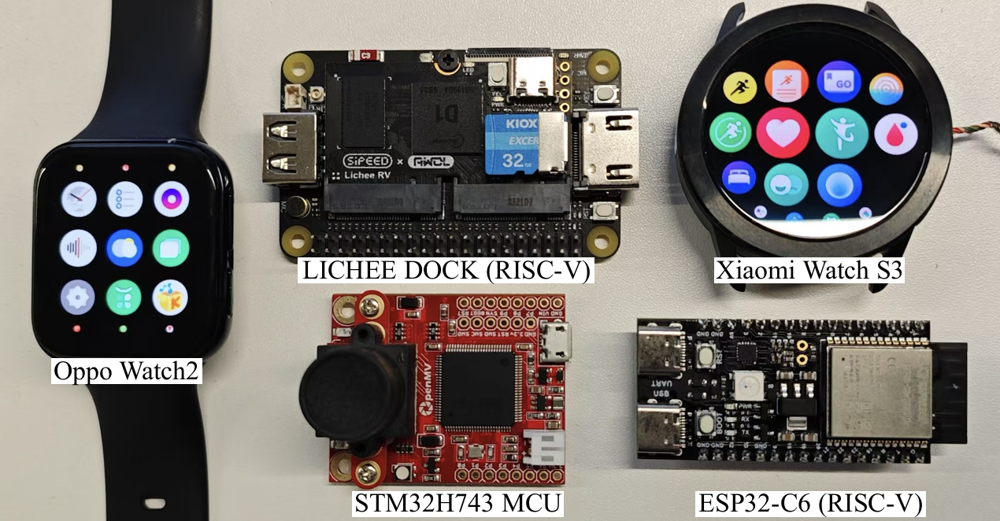

# RAMS Android Invoke APP Demo

This is an open-sourced demo application that allows for easy testing of RAMS. Using the source code, you can build an APP with Android Studio that can perform inference using a neural network implemented in C++ and display the inference time. The inference framework of neural networks includes two types: RAMS and TFLM.

RAMS can perform inference on the following devices:




## To Install / Run profile

### test

The executable model implementation is located in `app/src/main/cpp`. Compile APKS to execute different model inference:

For example, to inference the model in `cpp/rams/img5`

*   Modify `app/src/main/cpp/nativelib.cpp`
```C++
#include "rams/img5/demo.h"
Java_com_example_cppinvoke_NativeLib_getInferenceTime(JNIEnv* env, jobject /* this */) {
    double ms = static_cast<double>(invoke_img5()); // Modify the function name
    return ms;
}
```

*   Modify `app/src/main/cpp/CMakeLists.txt`
```txt
# First select your framework type. The code for the RAMS framework is located in the upper section
set(MODEL_ROOT "rams" CACHE STRING "Top-level model root under cpp")
set(MODEL_NAME "img5" CACHE STRING "Model folder inside MODEL_ROOT")
```

All ten APKS are available in **[Download APK](apks_10)**
